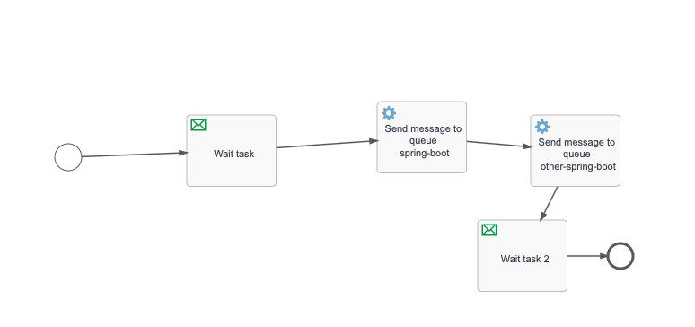
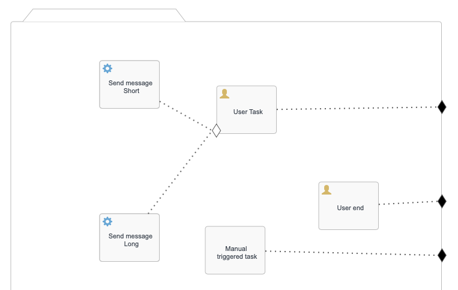
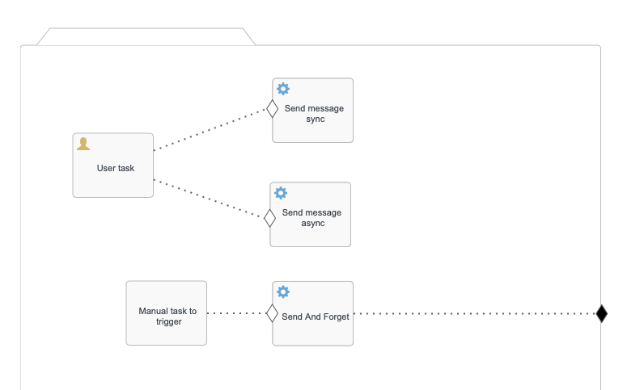

This repository is a simple project using docker to simulate
- Spring cloud (config + gateway + registry + flowable-tut)
- Flowable BPMN & CMMN with RabbitMQ message broker

Reference: 
- For spring cloud: https://github.com/sqshq/piggymetrics
- For Flowable: https://flowable.com/open-source/docs/oss-introduction/

Containers:
- 4 containers: Spring cloud (config + gateway + registry + flowable-tut)
- 1 container: mysql database
- 1 container: rabbitmq
- 1 container: Flowable UI (add .jar file for mysql connector + processes & cases folders)
- 1 spring boot app: subcriber (Subcriber/worker for RabbitMQ queues)

Build: at root folder of the project 
- Package java app for spring cloud: mvn package -Dmaven.test.skip=true
- Build images for docker: docker-compose build 

Run: 
- For docker: docker-compose -d up (at root folder)
- For subcriber: mvn spring-boot:run (at subcriber folder)

Note:
+ docker containers may run failed, retry with the same command
When running
+ subcriber need to connect to queues to start successfully. You should start a process or a case for the first time to create queues in rabbitmq
+ There are 01 process and 02 case models deployed when you start flowable-ui service, description files in:
    + ./flowable-tut/src/main/resources/processes
    + ./flowable-tut/src/main/resources/cases

Flowable BPMN:

- start process: localhost:8081/rabbit/start
- manual trigger 1st wait task: localhost:8081/rabbit/resume/{executionId}
(you can find executionId: select * from flowable.ACT_RU_EXECUTION;)
If the subcriber connects successfully, the process will be ended by a RabbitListern in the subcriber (trigger the 2nd wait task when receiving message).

Flowable CMMN:
Simple send and forget message publisher (user topic exchange)

Simple rpc pattern message publisher (direct exchange)

The ideas of 2 cmmn cases are as same as the bpmn above:
- start: localhost:8081/cm/start | localhost:8081/cm/startrpc
- complete user task to move on: localhost:8081/cm/complete/{caseId}/{taskId}
(find taskId: select * from flowable.ACT_RU_TASK;)
- trigger manual task to finish case: localhost:8081/cm/trigger/{planItemId}
(find planItemId: select * from flowable.ACT_CMMN_RU_PLAN_ITEM_INST;)

Please read the code to know more.
Hope it helps :)